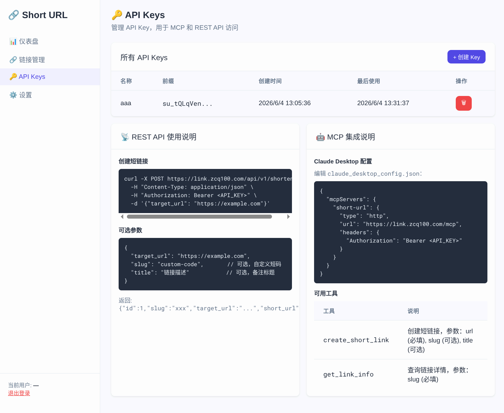

# 🔗 Short URL - Cloudflare Worker 短链接服务

基于 Cloudflare Workers + D1 的短链接服务，支持管理后台、API Key 管理、MCP 协议和点击统计图表。

线上地址: **[link.zcq100.com](https://link.zcq100.com)**

## 📸 截图

### 仪表盘



### API Keys 管理


## ✨ 功能

- 📎 **短链接跳转** — `GET /:slug` 301 重定向，异步点击计数
- 🖥️ **管理后台** — SPA 单页应用，仪表盘/链接管理/API Key/设置
- 📊 **数据图表** — 每日新增链接（柱状图）+ 访问量（折线图），热门链接 Top 10
- 🔑 **API Key** — Bearer Token 认证，支持 REST API 创建短链接
- 🤖 **MCP Server** — JSON-RPC 2.0 协议，AI Agent 直接创建和查询短链接
- 🔐 **Session 认证** — Cookie-based，24h 有效期，支持修改用户名密码
- 📈 **点击统计** — click_logs 表记录每次点击，按日聚合统计

## 🚀 部署

### 1. 安装依赖

```bash
npm install
```

### 2. 创建 D1 数据库

```bash
npx wrangler d1 create short-url-db
```

将输出的 `database_id` 填入 `wrangler.toml` 的 `[[d1_databases]].database_id` 字段。

### 3. 运行数据库迁移

```bash
# 生产环境
npx wrangler d1 execute short-url-db --remote --file=./migrations/0001_init.sql
npx wrangler d1 execute short-url-db --remote --file=./migrations/0002_click_logs.sql

# 本地开发
npx wrangler d1 execute short-url-db --local --file=./migrations/0001_init.sql
npx wrangler d1 execute short-url-db --local --file=./migrations/0002_click_logs.sql
```

### 4. 配置自定义域名

在 `wrangler.toml` 中修改 `routes.pattern` 为你的域名：

```toml
[[routes]]
pattern = "your-domain.com"
custom_domain = true
```

### 5. 部署

```bash
npm run deploy
```

## 📖 使用

### 默认管理员账户

首次启动时自动创建：

| 用户名 | 密码 |
|--------|------|
| `admin` | `admin123` |

⚠️ **部署后请立即修改密码！**

### 管理后台

访问 `https://<your-domain>/admin` 进入管理后台。

### REST API

```bash
# 创建短链接
curl -X POST https://<your-domain>/api/v1/shorten \
  -H "Content-Type: application/json" \
  -H "Authorization: Bearer <api-key>" \
  -d '{"target_url": "https://example.com"}'

# 可选参数
{
  "target_url": "https://example.com",   // 必填
  "slug": "custom-code",                 // 可选，自定义短码
  "title": "链接描述"                     // 可选，备注标题
}
```

### MCP 客户端配置

在 Claude Desktop 的 `claude_desktop_config.json` 中添加：

```json
{
  "mcpServers": {
    "short-url": {
      "type": "http",
      "url": "https://<your-domain>/mcp",
      "headers": {
        "Authorization": "Bearer <your-api-key>"
      }
    }
  }
}
```

### MCP 工具

| 工具名 | 描述 | 参数 |
|--------|------|------|
| `create_short_link` | 创建短链接 | `url` (必填), `slug` (可选), `title` (可选) |
| `get_link_info` | 查询链接信息 | `slug` (必填) |

## 📁 项目结构

```
short-url/
├── wrangler.toml              # Worker + D1 配置
├── package.json
├── tsconfig.json
├── migrations/
│   ├── 0001_init.sql          # 基础表（users/links/api_keys/sessions）
│   └── 0002_click_logs.sql    # 点击日志表
├── images/
│   ├── pic1.png               # 仪表盘截图
│   └── pic2.png               # API Keys 截图
├── src/
│   ├── index.ts               # Worker 入口，路由分发
│   ├── db.ts                  # D1 CRUD 封装
│   ├── auth.ts                # 认证模块（Session/API Key/密码哈希）
│   ├── redirect.ts            # 短链接 301 跳转
│   ├── api/
│   │   ├── auth.ts            # 登录/登出/修改密码 API
│   │   ├── links.ts           # 链接 CRUD + 统计 API
│   │   └── apikeys.ts         # API Key 管理 API
│   ├── mcp/
│   │   └── index.ts           # MCP Server (JSON-RPC 2.0)
│   └── admin/
│       └── html.ts            # 管理后台 SPA 单文件
└── README.md
```

## 🛠 技术栈

| 层级 | 技术 |
|------|------|
| 运行时 | Cloudflare Workers |
| 数据库 | Cloudflare D1 (SQLite) |
| 语言 | TypeScript |
| 管理后台 | 原生 HTML/CSS/JS + Chart.js |
| MCP 协议 | JSON-RPC 2.0 over HTTP (Streamable HTTP) |
| 认证 | Session Cookie + API Key (SHA-256) |
